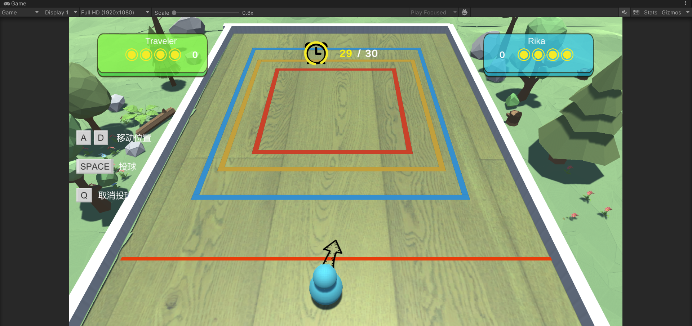
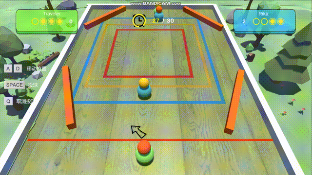

# ChaosBall
**基于原神小游戏雀球开发的小游戏**

### 1.游戏场景

### 2.游戏玩法
1. 每人有四次投球，投进圈中得分（红-4,黄-2,蓝-1）
2. 超时会放弃本次投球，并切换投球权
3. 可以将其他人的球撞出得分区

### 更新日志
1.设计关卡UI界面，之前的关卡未解锁不能游玩后面的关卡
2. 设计了一个新的功能球，AttachBall，在它发射后，会让第一个碰撞到它的球黏住，并一起运动

#### TODO
1. 开发更多的功能性球 
2. 开发更多的关卡
3. 实现完整的关卡选择
4. 尝试实现多人游戏匹配

##### UpdateTime 2024-11-7 16:32
##### UpdateTime 2024-11-11 15:40